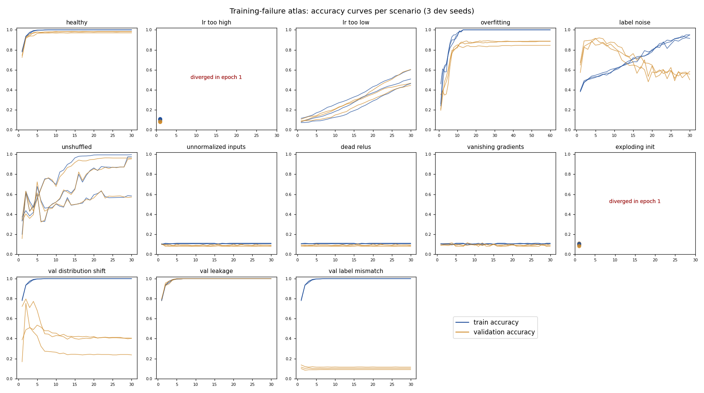

# training-failure-atlas

**Thirteen ways neural-network training goes wrong, each injected into real training runs and recorded as telemetry. A diagnostician identifies them from that telemetry alone and is scored on seeds it has never seen. A per-failure guide explains the signature, the usual misdiagnosis, a confirming check and the fix.**



```bash
pip install -e ".[dev]"
python evaluate.py          # 13 scenarios × 23 seeds = 299 training runs, ~3 min on 12 CPU cores
pytest -q                   # 17 tests
python probes.py --write    # "diagnose this run" prompts for language models
```

---

## Why

Most debugging advice for training is a checklist ("lower the learning rate", "add regularisation"). The hard part is the step before that: **reading the evidence correctly.** Several failures produce the *same* loss curve, and plausible-sounding advice confidently picks the wrong one. Look at the four flat panels in the atlas above: unnormalised inputs, dead ReLUs and vanishing gradients look identical by accuracy, but their step-0 telemetry is completely different.

## Setup

- **Data/model:** sklearn `digits` (8×8 images, 10 classes, ships with scikit-learn, so no download), an MLP, SGD with momentum.
- **Scenarios:** each changes exactly **one** thing from a healthy run (see [`atlas/scenarios.py`](atlas/scenarios.py)): learning rate too high or too low, overfitting, 50% label noise, unshuffled data, unnormalised inputs, dead ReLUs, vanishing gradients, exploding init, validation distribution shift, validation leakage, validation label-mapping mismatch.
- **Telemetry** (what a practitioner logs):
  - at step 0: input statistics, per-layer gradient norms, fraction of dead units;
  - per epoch: train/val loss and accuracy, per-layer gradient norms, the spread of mini-batch losses inside the epoch, and the dead-unit fraction.

## Results: how well can the telemetry identify the failure?

The diagnostician ([`atlas/diagnose.py`](atlas/diagnose.py)) is a transparent set of ordered rules. To keep the score honest:
- **v1** rules were written by looking only at **dev seeds 0–2**, then frozen and scored **once** on **held-out seeds 100–109**.
- **v2** adds one rule written after analysing v1's errors. It is scored on a **fresh set, seeds 200–209**, never on the seeds used to motivate it.

| Rule set | Seeds scored | Accuracy |
|---|---|---|
| v1 | dev 0–2 (used to write the rules) | 39/39 |
| **v1** | **held-out 100–109** | **123/130 (95%)** |
| **v2** | **fresh 200–209** | **124/130 (95%)** |

Per-scenario numbers and every confusion are in [`results/summary.md`](results/summary.md). All 299 runs' telemetry is in [`results/telemetry.jsonl`](results/telemetry.jsonl).

### What the errors taught us
1. **A too-high learning rate doesn't always diverge.** On 7 of 10 held-out seeds, LR 1.5 did *not* produce NaNs. The first epoch's gradients spiked 15–300× and then collapsed to exactly 0, leaving a flat loss. v1 called this "learning rate too low", **the classic misdiagnosis**. The distinguishing evidence is the gradient history (a spike, then dead), not the loss. v2's rule fixed all 10 fresh cases.
2. **Accuracy curves can't separate distribution shift from overfitting.** On 3 fresh seeds, a +3 std shift of the validation inputs produced a gap that *grew* over training, exactly like overfitting. The fix needs evidence the run didn't log: train-vs-val input statistics (planned for v3).
3. **"Chance level" is the wrong threshold for a label-mapping bug.** A random relabelling of 10 classes leaves ~1 class mapped to itself *on average*, so validation accuracy was 20–28% on 3 seeds, not 10%. The v2 rule's "< 20%" cut-off missed them. The robust signal is the confusion matrix being a near-permutation.
4. **Some failures are invisible in end-of-training metrics.** Unshuffled (class-sorted) data sometimes reaches 96% val accuracy by the end. Its signature is the within-epoch spread of batch losses (std up to 10 vs < 0.1 when healthy).
5. **With 50% label noise, validation accuracy *exceeds* training accuracy early** (0.89 vs 0.50 at epoch 3). That reliable tell was correct on 20/20 unseen runs.

## The guide

[**DIAGNOSES.md**](DIAGNOSES.md) covers each failure: **signature → commonly mistaken for → a cheap check that confirms it → fix**. All of it comes from these runs.

## Probing language models

`probes.py` renders each held-out run as the log a practitioner would see (step-0 stats and a per-epoch table, with no scenario name) and asks for a diagnosis, evidence, likely confusions, a confirming check and a fix. Answers are graded with a concept rubric and saved for human review.

```bash
python probes.py --write                       # 13 prompts in probes/
python probes.py --run claude-opus-5-5         # needs ANTHROPIC_API_KEY
```

*Model results are not reported yet.*

## Limitations

- **One small dataset and architecture.** The signatures are general, but the thresholds (e.g. batch-loss std > 0.5) are specific to this setup and would need recalibration for other models and data.
- **One failure at a time.** Real runs often combine two (e.g. a high LR *and* unnormalised inputs).
- **The diagnostician is rule-based on purpose,** so every decision cites its evidence. A learned classifier over the same features is a natural next step.

## License

MIT
